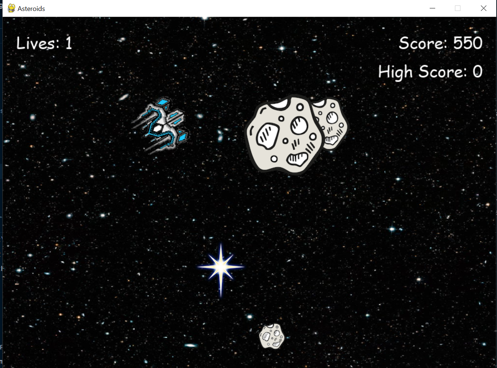

# Asteroids - Remastered

A Python-based implementation of the classic arcade game **Asteroids**.



## Overview

This project is a recreation of the Asteroids game using Python. The game involves controlling a spaceship in space, avoiding and destroying asteroids to score points.

## Features

- **Player Controls:** Use arrow keys to navigate the spaceship.
- **Shooting Mechanism:** Destroy asteroids to earn points.
- **Scoring System:** Keep track of the player's score.

## Installation

1. Clone the repository:
   ```bash
   git clone https://github.com/abdz-128/Asteroids.git
    ```

2. Navigate to the project directory:
   ```bash
   cd Asteroids
   ```

3. Install the required dependencies:
   ```bash
   pip install -r requirements.txt
   ```

## Usage
To start the game, run the following command:
```bash
python main.py
```

## Project Structure
- `assets/`: Contains game assets such as images and sounds.
- `src/`: Contains the source code for the game.
- `utils/`: Contains utility functions for the game.

## License
This project is licensed under the MIT License. See the [LICENSE](LICENSE) file for more information.


## Contact
- **Email:** sasyed12.ss@hotmail.com

